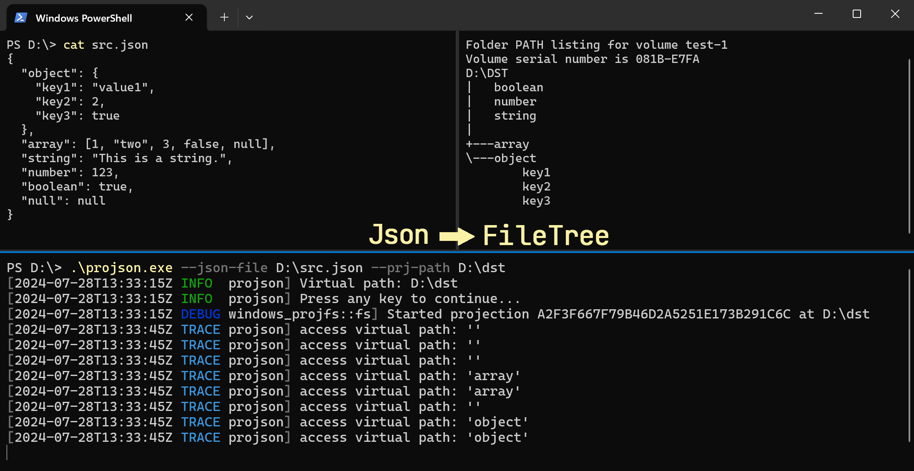

# projson

[中文](./README_ZH.md)

This project uses ProjFS to map JSON to file tree.



## Usage

Before running, please ensure that the optional Windows feature: ProjFS is enabled. To enable the ProjFS feature, you can use the following PowerShell command.

```powershell
Enable-WindowsOptionalFeature -Online -FeatureName Client-ProjFS -NoRestart
```

After enabling the ProjFS feature, use `projson --help` to view the usage information.

```powershell
Usage: projson.exe --prj-path <Virtual root directory path> <--json-file <Json file path>|--json-text <Json text>>

Options:
  -f, --json-file <Json file path>              Specifies the JSON file to read
  -t, --json-text <Json text>                   Specifies the JSON text to read
  -p, --prj-path <Virtual root directory path>  Specifies the virtualization root directory path
  -h, --help                                    Print help
  -V, --version                                 Print version
```

When mapping JSON to files or directories, the JSON key will be the file or directory name, and the type of the value will determine whether the key-value pair is mapped to a file or a directory, according to the following rules:

- Object: Directory, the object's sub key-values are directory items.
- Array: Directory, the elements in the array are directory items.
- String: File, the file content is the string value.
- Number: File, the file content is the numeric value.
- Boolean: File, the file content is 'true' or 'false'.
- Null: Empty file.

## Example

Map JSON as a file tree from file.

```powershell
projson.exe --json-file src.json --prj-path D:\dst
```